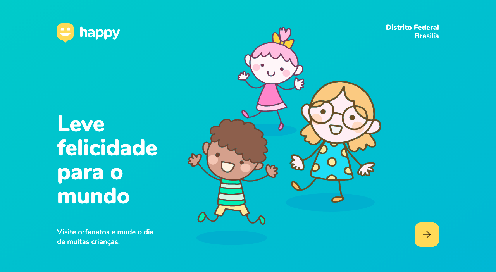
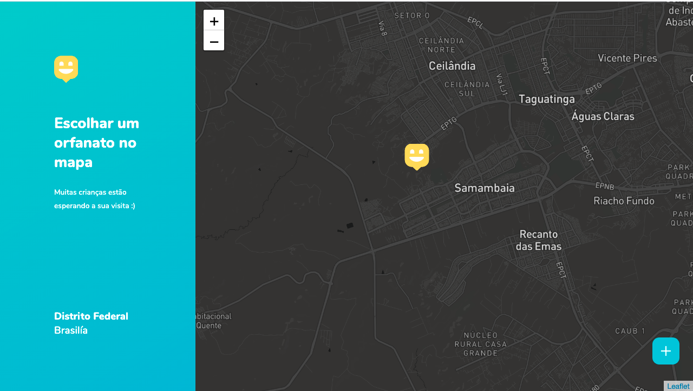
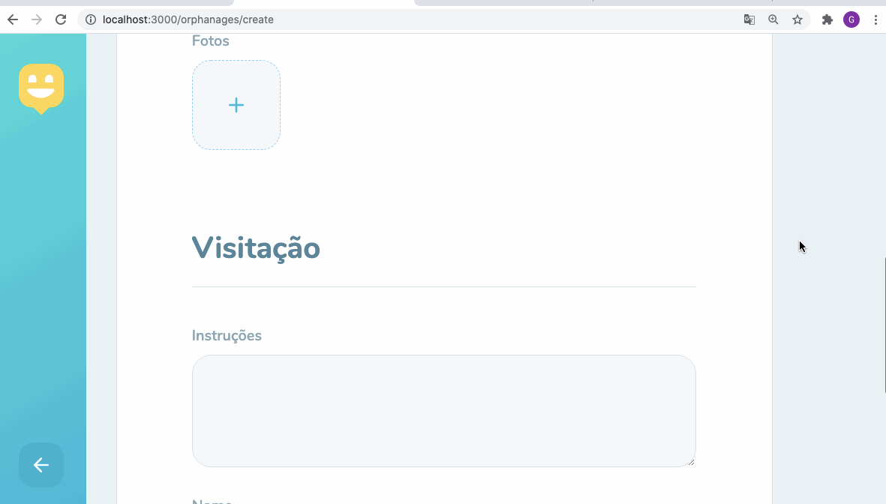
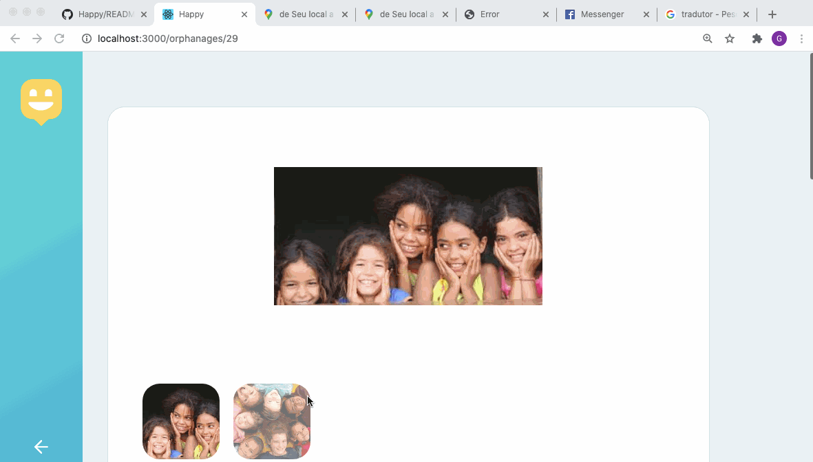

<h1 align="center">NLW Rockeseat - Front-End :heart_eyes:</h1>  

<h4 align="center">
   
</h4>

  <a href="#tecnologias">Tecnologias</a>&nbsp;&nbsp;&nbsp;|&nbsp;&nbsp;&nbsp;
  <a href="#page_facing_up-sobre">Sobre</a>&nbsp;&nbsp;&nbsp;|&nbsp;&nbsp;&nbsp;
  <a href="#-como-usar">Como usar</a>&nbsp;&nbsp;&nbsp;|&nbsp;&nbsp;&nbsp;
  <a href="#features">Features</a>&nbsp;&nbsp;&nbsp;|&nbsp;&nbsp;&nbsp;
  <a href="#pencil-autor">Autor</a>

## :wrench: Tecnologias

<!--EXEMPLO:-->
- [React](https://pt-br.reactjs.org/)
- [Axios](https://www.npmjs.com/package/axios)
- [React Router](https://www.npmjs.com/package/react-router-dom)
- [Leaflet](https://www.npmjs.com/package/leaflet)
- [React-Leaflet](https://www.npmjs.com/package/react-leaflet)
- [React-Icons](https://react-icons.github.io/react-icons/)

## :page_facing_up: Sobre
Esse projeto Happy, foi desenvolvido para cadastro de orfanatos. Feito o Cadastro poderá ser
visto o local e rota e todos os detalhes sobre orfanato.
## 💻 Como usar

- Clone o projeto: `git clone https://github.com/Gabriel200395/Happy.git`
- Entrar na pasta do projeto: `cd web`
- Iniciar a aplicação: `npm start`
- baixe na aplicação: `npm install`

Irá abrir uma página no browser (se não abrir, vá até [http://localhost:8080](http://localhost:8080/)).

## :heart_eyes: Features

<h3 align="center">Tela da Home</h3>
<h4 align="center">
   
</h4>

<h3 align="center">Tela da App Inicial</h3>
<h4 align="center">
   
</h4>

<h3 align="center">Tela de Cadastro</h3>
<h4 align="center">
   
</h4>

<h3 align="center">Tela de Visualizar Cada Orfanato</h3>
<h4 align="center">
   
</h4>

## :pencil: Autor

<table>
  <tr>
    <td align="center"><a href="https://github.com/Gabriel200395"> <b>Gabriel Souza</b></a> </td>
  <tr>
</table>
